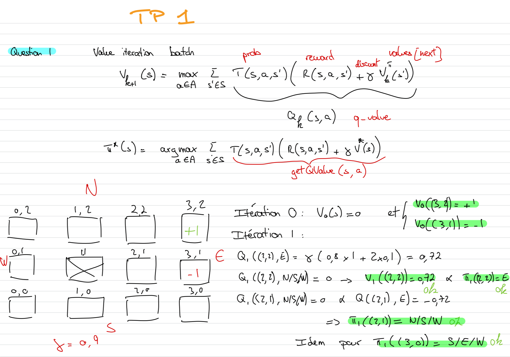
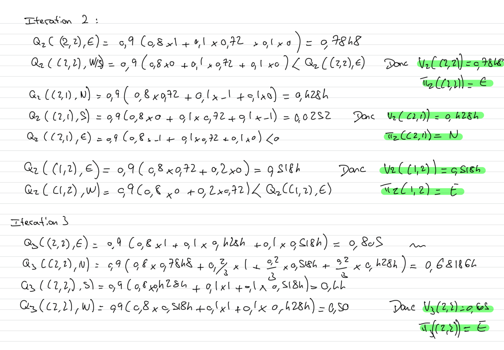
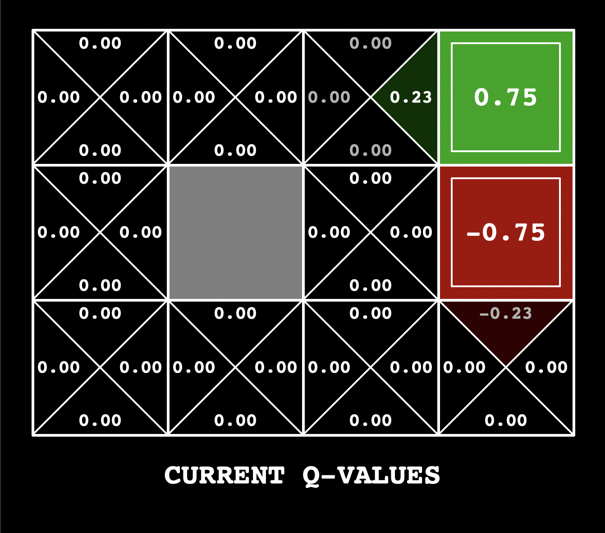
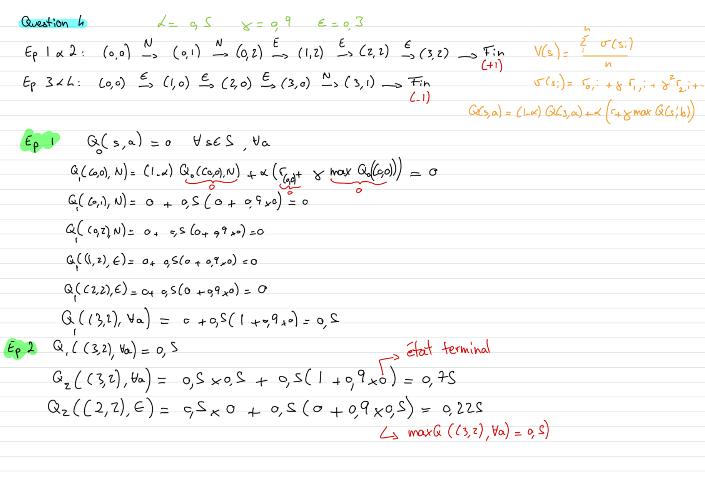
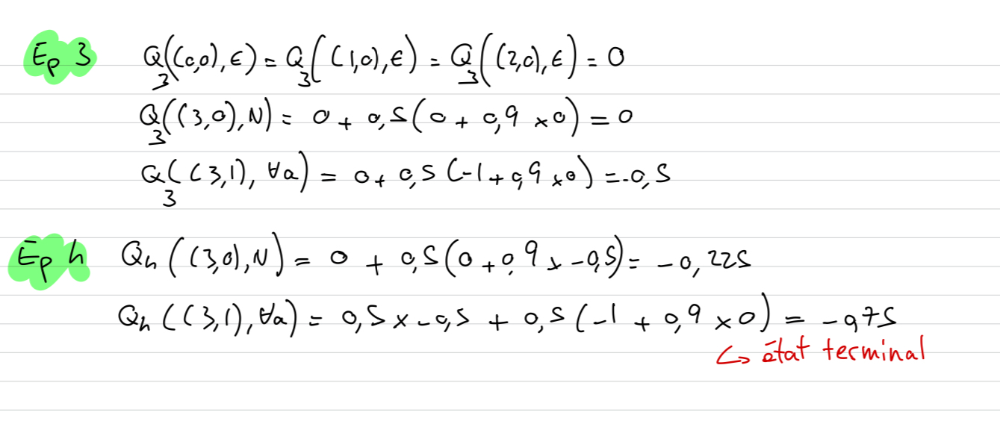
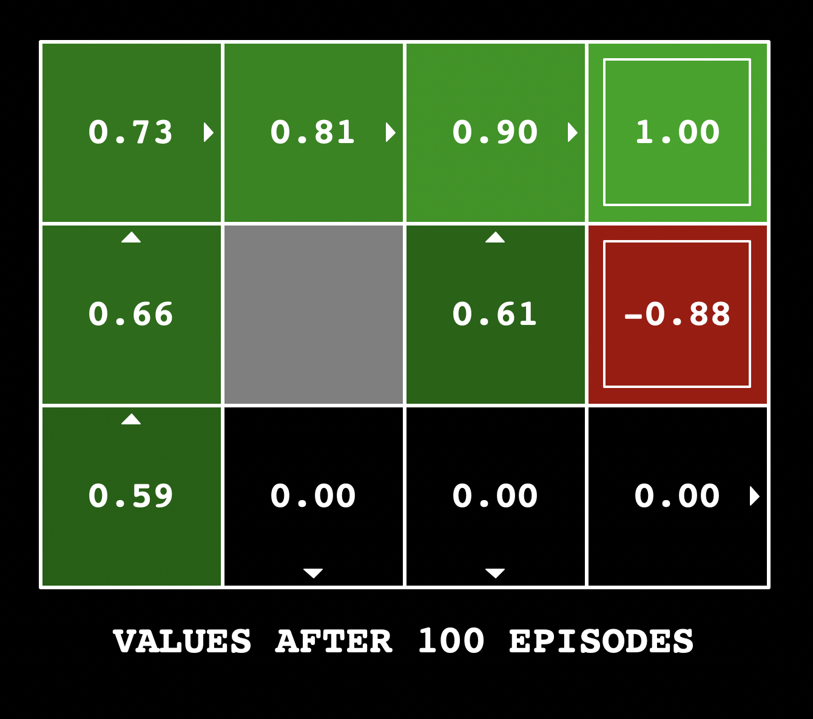
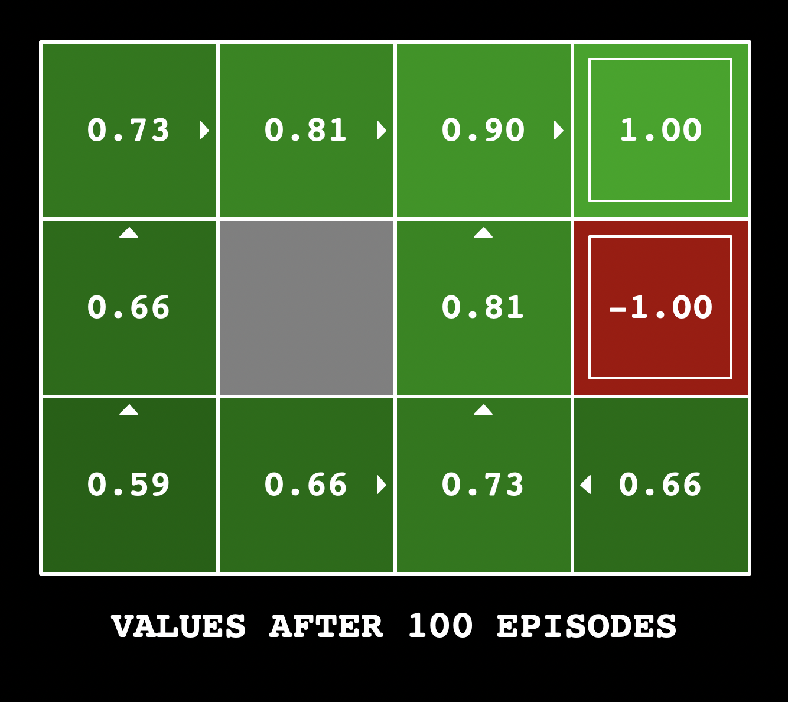

# RAPPORT

## Partie 1: Value Iteration

### Question 1 
*Préciser le détail du calcul de la politique gloutonne pour les 3 premières itérations de Value Iteration dans l'environnement BookGrid avec les paramètres par défaut*

### Question 2
*Modifier un seul des 2 paramètres (noise ou discount) pour obtenir une politique optimale qui permet à l'agent de traverser le pont (s'il n'était pas soumis au bruit). Préciser le paramètre modifié et sa valeur dans votre rapport et justifier votre choix.*

Paramètre modifié: `noise = 0.0` (au lieu de 0.2)

Justification:
Le problème avec les paramètres par défaut est que le bruit (noise=0.2) crée un risque de 20% de dévier perpendiculairement à la direction souhaitée. Sur le pont, cela signifie:

Probabilité de 0.2 de tomber dans les cases -100
Perte espérée par déplacement: 0.2 × (-100) = -20

Ce qui donne pour le calcul de l'espérance:
`E(traverser) = P(succés) × 10 + P(échec) × (-100)`
5 étapes et le bruit à 0.2:
 - `P(success) = 0.8^5 ≈ 0.33`
 - `P(failure) ≈ 0.67`
Soit `E(traverser) ≈ 0.33×10 + 0.67×(-100) = 3.3 - 67 = -63.7`
vs `E(rester) = 1`

Avec 5 déplacements nécessaires pour traverser: risque cumulé très élevé

En mettant noise = 0.0:

 - L'environnement devient déterministe
 - L'agent peut traverser sans risque de tomber
 - La récompense +10 devient atteignable sans danger avec `E(traverser) = 10`
 - La politique optimale dirigera l'agent vers la droite pour obtenir +10

### Question 3
*Modifier un seul des 3 paramètres (noise, discount, livingReward) pour obtenir les politiques optimales ci-dessous. Préciser pour chaque politique, le paramètre modifié et sa valeur dans votre rapport et justifier votre choix.*

1. qui suit un chemin risqué pour atteindre l’état absorbant de récompense +1 ;
2. qui suit un chemin risqué pour atteindre l’état absorbant de récompense +10 ;
3. qui suit un chemin sûr pour atteindre l’état absorbant de récompense +1 ;
4. qui évite les états absorbants

1. Chemin risqué vers +1

Paramètre modifié: `discount = 0.1`
Pourquoi: Avec un discount très faible, l'agent privilégie les récompenses immédiates. Le chemin le plus court vers +1 (3 actions) devient optimal malgré le risque de tomber dans -10. Les pénalités futures sont fortement dévaluées.

3. Chemin sûr vers +1

Paramètre modifié: `discount = 0.3`
Pourquoi: Avec un discount un peu haut, les récompenses futures conservent un peu plus leur valeur, l'agent va pouvoir se projeter en passant par le haut mais pas au point d'aller chercher le +10.

2. Chemin risqué vers +10
Paramètre modifié: `livingReward = -1`
Pourquoi: Avec une pénalité de 1 par étapes en vie, l'agent est encouragé à terminer rapidement. Un +1 n'étant pas suffisant pour combler ses pertes, il se dirige vers le +10 avec le chemin le plus court. 

4. Chemin évitant les états absorbant de récompense +1
Paramètre modifié: `livingReward = 1`
Pourquoi : Il gagne 1 par étape donc l'espérance de gain en allant sur une autre case sera toujours plus forte que celle d'aller sur un état absorbant +1.

## Partie 2: QLearning tabulaire

### Question 4
*Précisez le détail du calcul des qvaleurs pour les 3 premiers épisodes.*

### Question 5
*Expliquer les différences entre le résultat obtenu avec epsilon à 0.1 et à 0.9.*

Quand `epsilon = 0.1`, l'agent est greedy à 90%, il a donc tendance à ne visiter que les chemins qui lui promettent des récompenses, c'est à dire ceux qu'il a visité au début. C'est pour ça qu'il n'y a du vert que d'un côté. 

Quand `epsilon = 0.9`, c'est l'inverse! L'agent aime explorer et a tendance à ignorer les récompenses 90% du temps. C'est pour ça que la plupart des cases sont explorées et que leur q_values ont été mises à jour. 

### Question 6
*Préciser comment est modélisé l'environnement robot crawler sous forme de MDP (état, action, récompense) ainsi que la dimension de S. Quel est le comportement attendu de l'agent s'il suit sa politique optimale ?*

L'état (s) est défini par un tuple (armBucket, handBucket) (lines 20-39): 
 - `armBucket` représente les 9 angles/positions possibles du bras.
 - `handBucket` représente les 13 angles/positions possibles de la main.
Cela fait 117 états en tout. 

Les actions possibles (a) sont (lines 61-64): 
 - 'arm-up': Lever le bras (si pas déjà au maximum)
 - 'arm-down': Baisser le bras (si pas déjà au minimum)
 - 'hand-up': Lever la main (si pas déjà au maximum)
 - 'hand-down': Baisser la main (si pas déjà au minimum)

La récompense est définie par la distance parcourue (line 105):
 - reward = newX - oldX

### Question 7
*Expliquer les résultats obtenus et préciser dans le rapport les solutions que l'on peut mettre en place pour améliorer ces résultats.*

On voit bien que dans la small_grid, pacman s'en sort très bien et a presque 100% de victoire.
Dans la medium_grid, c'est l'inverse, il ne gagne quasiment jamais et son comportement semble presque aléatoire. 

Explication : 
 - L'espace d'état devient beaucoup trop grand lors du passage de small_grid à medium_grid. Sur la small_grid il y a 9 positions possibles pour lui, le fantom et la nourriture. On est maximum à 9^3 (729) x position des capsules/murs/récompense. Sur la medium_grid, il y a déjà 16^3 * 16 * 16 comme il y a trois récompenses (1 048 575). C'est donc impossible de visiter tous les états en 2000 épisodes, ce qui explique son comportement aléatoire. De plus, les récompenses sont assez rares et pacman n'est pas capable d'apprendre la similarité entre certain état car le qlearning tabulaire traite chaque état indépendamment des autres. 

Pour donner d'autres solutions que celle implémentée en question 8 : 
 - On pourrait utiliser des positions relatives plutôt qu'absolues, ce qui permettraient de ne pas avoir une explosion sur le nombre d'état lorsque la grille est plus grande.
 - Faire plus d'entraînement...
 - Augmenter les récompenses pour encourager **l'approche** de la nourrite ou pénaliser **l'approche** des fantômes. 

### Question 8
*Expliquer dans le rapport les features que vous avez implémentées et leurs rôles. Présenter et analyser les résultats obtenus.*

Features implémentées dans ExpertExtractor:

 - `bias`: Terme constant (1.0) pour l'apprentissage de base
 - `eats-food`: 1 si l'action mange de la nourriture (condition: pas de danger)
 - `closest-food`: Distance normalisée à la nourriture la plus proche
 - `ghosts-1-step-away`: Nombre de fantômes à 1 case de distance
 - `closest-capsule`: Distance normalisée à la capsule la plus proche pour guider pacman vers les capsules s'il est menacé
 - `eats-capsule`: Récompense le poussant à chasser
 - `closest-scared-ghost`: Distance au fantôme effrayé le plus proche pour lui permettre de chasser
 - `eats-scared-ghost`: Récompense s'il réussi à chasser
 - `danger-normal-ghost`: Éviter les fantômes avec différents malus en fonction de la proximitée

